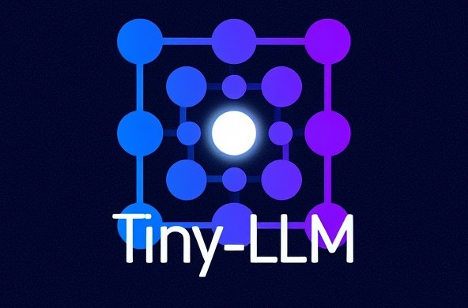

# Tiny-LLM

<p align="center">
  
</p>

A compact, modern decoder-only language model built directly in PyTorch. The
project exposes the complete local pipeline: public-data preparation,
tokenizer training, pretraining, reasoning/tool supervised fine-tuning,
evaluation, and terminal/web chat.

## What is included

- RMSNorm, RoPE, SwiGLU, QK normalization, and grouped-query attention
- PyTorch scaled dot-product attention with native GQA where available
- 2,048-token context and 8,192-token SentencePiece vocabulary
- Bias-free projections and depth-scaled residual initialization
- Mixed precision, activation checkpointing, fused AdamW, gradient clipping,
  warmup/cosine decay, and auxiliary logit z-loss
- Canonical multi-turn messages with system, developer, user, assistant, and
  tool roles
- Assistant-only loss masking for reasoning traces, tool calls, and answers
- Multi-round tool execution with a safe calculator and timezone-aware clock
- Streaming terminal chat, persistent sessions, personas, and local web UI
- Exact dataset revisions, resumable downloads, rate limiting, normalization,
  content deduplication, checksums, and deterministic splits

The implementation is intended for learning and local experimentation. A tiny
model needs actual pretraining and SFT before it can use these capabilities
reliably.

## Data snapshot

The pinned starter snapshot includes:

- 5,000 FineWeb-Edu pretraining documents
- 297 additional unique local Markdown documents
- 1,000 OpenR1 Math reasoning examples
- 2,000 Dolci tool-use examples
- 300 Tülu MAX thinking/tool examples

The 297 Markdown documents exist in two mirrored locations but are included
once by normalized content hash. Public SFT is split into 3,127 training and
173 validation records.

See [public_datasets.md](docs/public_datasets.md) for revisions and terms, and
[dataset_requirements.md](docs/dataset_requirements.md) for the accepted data
contract.

## Requirements

- Python 3.10+
- PyTorch 2.6+
- SentencePiece 0.2+
- NumPy, PyYAML, tqdm, and aiofiles

CPU execution is supported but training is slow. A CUDA GPU with at least 16 GB
VRAM is recommended for the shipped 2,048-token settings. Install the current
PyTorch build appropriate for your OS and CUDA runtime using the
[official selector](https://pytorch.org/get-started/locally/), then install:

```powershell
python -m venv .venv
.\.venv\Scripts\Activate.ps1
pip install -r requirements.txt
```

Verify the runtime:

```powershell
python -c "import torch; print(torch.__version__); print('cuda=', torch.cuda.is_available()); print('cuda_runtime=', torch.version.cuda)"
```

## End-to-end run

```powershell
python scripts/download_public_datasets.py --config configs/public_datasets.yaml --stage all
python scripts/train_tokenizer.py --config configs/tokenizer.yaml
python scripts/prepare_data.py --config configs/pretrain_tiny.yaml
python scripts/train_pretrain.py --config configs/pretrain_tiny.yaml
python scripts/train_sft.py --config configs/sft_tiny.yaml
python scripts/eval_checkpoint.py --chat-config configs/chat.yaml --sft-config configs/sft_tiny.yaml --pretrain-config configs/pretrain_tiny.yaml
python scripts/chat.py --config configs/chat.yaml
```

For resume commands and the web UI, see [ExecSeq.md](ExecSeq.md).

## Architecture defaults

| Setting | Value |
|---|---:|
| Layers | 8 |
| Model width | 384 |
| Query heads | 6 |
| Key/value heads | 2 |
| Context | 2,048 |
| Vocabulary | 8,192 |
| MLP | SwiGLU, 2.667x rounded to 128 |
| Positions | RoPE, theta 1,000,000 |
| Normalization | RMSNorm + per-head QK norm |

The architecture and optimization rationale is documented in
[model_upgrades.md](docs/model_upgrades.md).

## Thinking and tool protocol

The tokenizer reserves explicit control tokens:

```text
<|tools|> ... </|tools|>
<|think|> ... </|think|>
<|tool_call|> ... </|tool_call|>
<|tool_response|> ... </|tool_response|>
```

Tool definitions use JSON Schema. During inference, the assistant can emit one
or more calls, the local runtime executes registered tools, appends their
results as tool messages, and asks the model to continue. The built-in
calculator parses a restricted arithmetic AST and cannot execute arbitrary
Python or shell code.

## Repository map

```text
configs/                    model, training, chat, and dataset pins
data/raw/                   local Markdown corpus
data/raw/public_fineweb/    downloaded FineWeb-Edu subset
data/public_sft/            normalized reasoning/tool SFT split and manifest
docs/                       architecture and dataset documentation
scripts/                    download, prepare, train, evaluate, and chat CLIs
src/chat_format.py          canonical multi-turn serialization and loss masks
src/tools.py                tool schemas, parsing, and safe built-ins
src/model.py                modern decoder-only Transformer
src/trainer.py              pretraining/SFT optimization loop
tests/                      architecture, data, masking, and runtime tests
```

Large downloaded datasets and generated tokenizer/array artifacts are ignored
by Git. The small public-data manifest remains tracked for reproducibility.

## Checkpoint migration

Old `pretrain_tiny` and `sft_tiny` checkpoints are not compatible with the new
GQA projection shapes or tokenizer. Retrain into:

- `checkpoints/pretrain_modern/`
- `checkpoints/sft_modern/`

Checkpoint loading verifies both model-configuration and tokenizer
fingerprints so stale combinations fail early.

## Validation

```powershell
python -m unittest discover -s tests
python -m compileall -q src scripts tests
git diff --check
```

## Scope

Tiny-LLM does not yet provide distributed training, retrieval augmentation,
constrained JSON decoding, production serving, or frontier-scale evaluation.
Reasoning traces improve the training signal but are not guaranteed to be
correct or faithful. Review all dataset licenses and upstream terms before
redistributing data, weights, or outputs.
